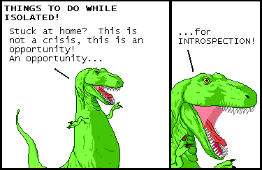

# Spectacle

`Spectacle` recursively walks down the structure on which it is called, visiting each struct field, enum variant, etc. It operates via the [`Any` trait](https://doc.rust-lang.org/std/any/trait.Any.html). It also includes the trail of accessors and selectors describing how to get to the current location from the root object. Given those two things, it is straightforward to find and access the portion of data of interest.

Introspection should not generally be the tool of first resort. However, there are occasions when they are indespensible. The use case which prompted the invention of this crate: writing a strongly-typed serde codec for large, complex, deeply-nested, underspecified JSON blobs. Working from the outside in, it was possible to write types for the outermost containers without much trouble. However, determining the appropriate type for certain uncommon, inner fields was complicated, as there were many examples, deeply nested.

The solution was to introspect, visiting in particular all those values which were still a `serde_json::Value`. By printing the representation of each, it was possible to discover the appropriate encoding to use.

> 
>
> [_Dinosaur Comics_ by Ryan North](http://www.qwantz.com/index.php?comic=3579)

## Features

- [x] `Spectacle` trait: visitor over contained fields, variants, etc
- [x] `impl Spectacle for $primitive`
- [x] (default) feature-gated `impl Spectacle for $collection`
- [x] feature-gated `impl Spectacle for serde_json::Value`
- [ ] `#[derive(Spectacle)]`
